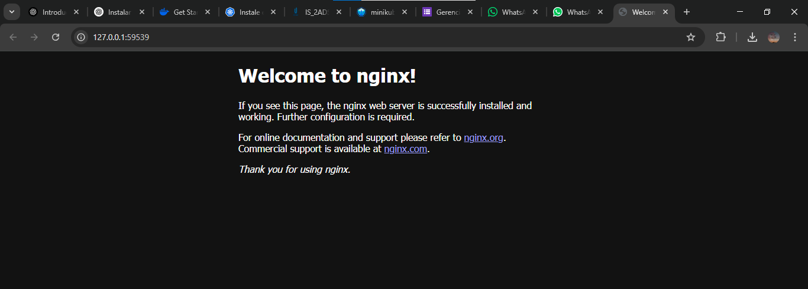
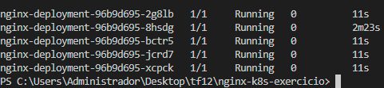

# Nginx Kubernetes Exercise

Este projeto contém a implementação de um Deployment e um Service para o Nginx utilizando Kubernetes. O objetivo é demonstrar como criar, escalar e gerenciar uma aplicação Nginx em um cluster Kubernetes local utilizando o Minikube. 

## Pré-requisitos

Antes de executar este projeto, você precisa ter as seguintes ferramentas instaladas:

- kubectl
- Minikube
- Git

## Instruções de Uso

1. **Verifique o Status do Cluster:**
   Confirme se o Minikube está em execução e se o kubectl consegue se comunicar com ele:
   ```
   kubectl cluster-info
   ```

2. **Crie os Recursos:**
   Aplique o arquivo `nginx-deployment.yaml` para criar o Deployment:
   ```
   kubectl apply -f nginx-deployment.yaml
   ```

3. **Verifique o Status da Implantação:**
   Confira o status do Deployment e dos pods:
   ```
   kubectl get deployments
   kubectl get pods
   ```

4. **Crie o Service:**
   Aplique o arquivo `nginx-service.yaml` para criar o Service:
   ```
   kubectl apply -f nginx-service.yaml
   ```

5. **Verifique o Status do Serviço:**
   Confira o status do Service:
   ```
   kubectl get services
   ```

6. **Acesse a Aplicação:**
   Descubra a URL para acessar a aplicação Nginx via Minikube:
   ```
   minikube service nginx-service --url
   ```
   Acesse a URL no seu navegador ou utilizando o comando curl para confirmar que a aplicação está funcionando.

7. **Escale a Aplicação:**
   Edite o arquivo `nginx-deployment.yaml` e altere o número de réplicas para 5. Aplique as mudanças:
   ```
   kubectl apply -f nginx-deployment.yaml
   ```
   Verifique novamente o status dos pods:
   ```
   kubectl get pods
   ```

8. **Reduza a Aplicação:**
   Edite o arquivo `nginx-deployment.yaml` novamente e diminua o número de réplicas de volta para 1. Aplique as mudanças:
   ```
   kubectl apply -f nginx-deployment.yaml
   ```
   Confirme a redução dos pods:
   ```
   kubectl get pods
   ```

9. **Explore os Logs:**
   Visualize os logs de um dos pods do Nginx:
   ```
   kubectl logs nginx-deployment-96b9d695-wqzg8
   # ou substitua pelo nome do seu pod exibido em 'kubectl get pods'
   ```

10. **Limpe o Ambiente:**
    Delete o serviço e a implantação utilizando os arquivos YAML:
    ```
    kubectl delete -f nginx-service.yaml
    kubectl delete -f nginx-deployment.yaml
    ```
    Verifique se os pods e serviços foram removidos:
    ```
    kubectl get deployments
    kubectl get services
    ```

## Imagens



